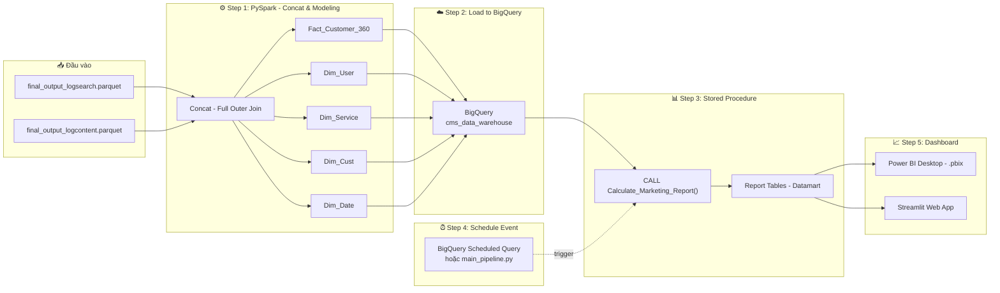

# 🚀 Customer 360 & Marketing Analytics Pipeline

Dự án Data Engineering End-to-End xây dựng luồng dữ liệu (Data Pipeline) hoàn chỉnh để phân tích hành vi người dùng (Customer 360) và tạo ra các báo cáo quản trị chiến lược cho bộ phận Marketing. 

Dự án mô phỏng môi trường dữ liệu thực tế tại các công ty Truyền hình/Giải trí trực tuyến (OTT), tự động hóa toàn bộ quy trình từ lúc thu thập Log thô đến khi hiển thị Dashboard trên Web.

**🌐 Live Dashboard (Streamlit Cloud):** [https://customer-360-data-pipeline-gnqmpymbhbtsoxs3dnbk4n.streamlit.app/](https://customer-360-data-pipeline-gnqmpymbhbtsoxs3dnbk4n.streamlit.app/)

## 📐 Kiến trúc hệ thống (Architecture)



## 🛠️ Công nghệ sử dụng (Tech Stack)

- **Ngôn ngữ:** Python 3.12, SQL
- **Phân tán & Xử lý Dữ liệu lớn (Big Data):** Apache Spark (PySpark), Pandas
- **Kho dữ liệu (Data Warehouse):** Google BigQuery
- **Trí tuệ nhân tạo (AI):** Google Vertex AI (Phân loại Log Search)
- **Trực quan hóa (BI & UI):** Power BI Desktop, Streamlit
- **Điều phối (Orchestration):** Python Script (`main_pipeline.py`) & Windows Task Scheduler

---

## 🗂️ Quy trình Pipeline (Data Flow)

Dự án được chia làm 4 giai đoạn rõ rệt, tuân thủ nguyên tắc **ETL - ELT**:

### 1. Extract & Transform (Log Processing)
- Đọc dữ liệu phi cấu trúc từ `log_search` (file text, phân tách bằng tab) và `log_content` (dạng JSON).
- Gọi API **Vertex AI (Gemini)** để chuẩn hóa và phân loại tự động các từ khóa tìm kiếm bị lỗi phông hoặc viết tắt.

### 2. Data Modeling (Star Schema)
- Thực hiện gom nhóm (Concat / Full Outer Join) hai luồng dữ liệu.
- Thiết kế mô hình dữ liệu **Star Schema**, bóc tách thành 5 bảng:
  - Bảng Trung tâm: `Fact_Customer_360`
  - Bảng Chiều (Dimensions): `Dim_User`, `Dim_Cust`, `Dim_Service`, `Dim_Date`
- Lưu trữ dưới dạng định dạng Columnar là `.parquet` để tối ưu hóa việc đọc/ghi.

### 3. Load & ELT (BigQuery)
- Load tự động 5 bảng Parquet lên **Google BigQuery** thông qua `pandas-gbq`.
- Sử dụng các **Stored Procedures** viết bằng SQL trên BigQuery để tính toán các chỉ số kinh doanh sâu (OLAP):
  - `olap_category_loyalty`: Phân tích tỷ lệ giữ chân khách hàng (Retention).
  - `olap_category_taste`: Phân tích sở thích (Content Taste) của từng tệp người dùng.
  - `olap_search_growth`: Phân tích tốc độ tăng trưởng tìm kiếm (Run Rate).
  - `olap_interest_migration`: Phân tích luồng dịch chuyển sở thích.

### 4. Visualization (Dashboard & Web)
- Kết nối **Power BI Desktop** trực tiếp với các bảng OLAP trên BigQuery bằng DirectQuery/Import.
- Publish báo cáo lên Power BI Service.
- Xây dựng **Web Application** bằng **Streamlit** để nhúng báo cáo Power BI, tạo thành một hệ thống giám sát Marketing hoàn chỉnh, độc lập và dễ dàng chia sẻ cho C-level.

---

## 🚀 Hướng dẫn cài đặt và vận hành (Run Locally)

### 1. Cài đặt môi trường
Cài đặt các thư viện cần thiết thông qua `requirements.txt`:
```bash
pip install -r requirements.txt
```

### 2. Cấu hình Credentials
Đặt file chứng chỉ của Google Cloud Platform `bigdata-mapping-*.json` vào thư mục gốc của dự án để PySpark và BigQuery có thể chứng thực.

### 3. Vận hành Pipeline tự động
Chỉ cần chạy file tổng (Orchestrator). Script sẽ tự động dò tìm ngày dữ liệu mới nhất, xử lý và đẩy lên Cloud:
```bash
python main_pipeline.py
# Hoặc chạy file batch: run_pipeline.bat
```
*(Bạn cũng có thể truyền biến thời gian cụ thể: `python main_pipeline.py --start 20220601 --end 20220714`)*

### 4. Xem Dashboard trên Web
Để khởi động giao diện Web Streamlit (đã nhúng Power BI):
```bash
streamlit run app.py
```

---

## 📝 Kiến trúc Thư mục

```text
Class7/
├── data/                               # Chứa Raw Logs (log_search, log_content)
├── etl_step1_log_search.py             # Script xử lý Log Search & gọi Vertex AI
├── etl_step1_log_content.py            # Script xử lý Log Content
├── etl_step2_obt_concat_model.py       # Script Data Modeling (Star Schema)
├── etl_step3_load_to_bigquery.py       # Script Load data lên BigQuery
├── main_pipeline.py                    # Trình điều phối (Orchestrator) toàn bộ Pipeline
├── elt_stored_procedure.sql            # Các hàm Stored Procedure chạy trên BigQuery
├── app.py                              # Mã nguồn Giao diện Web (Streamlit)
├── run_pipeline.bat                    # Script chạy nhanh trên Windows
├── requirements.txt                    # Thư viện Python
└── README.md                           # Tài liệu dự án
```
