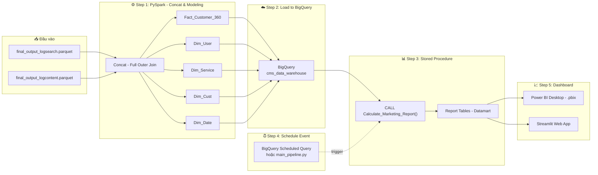
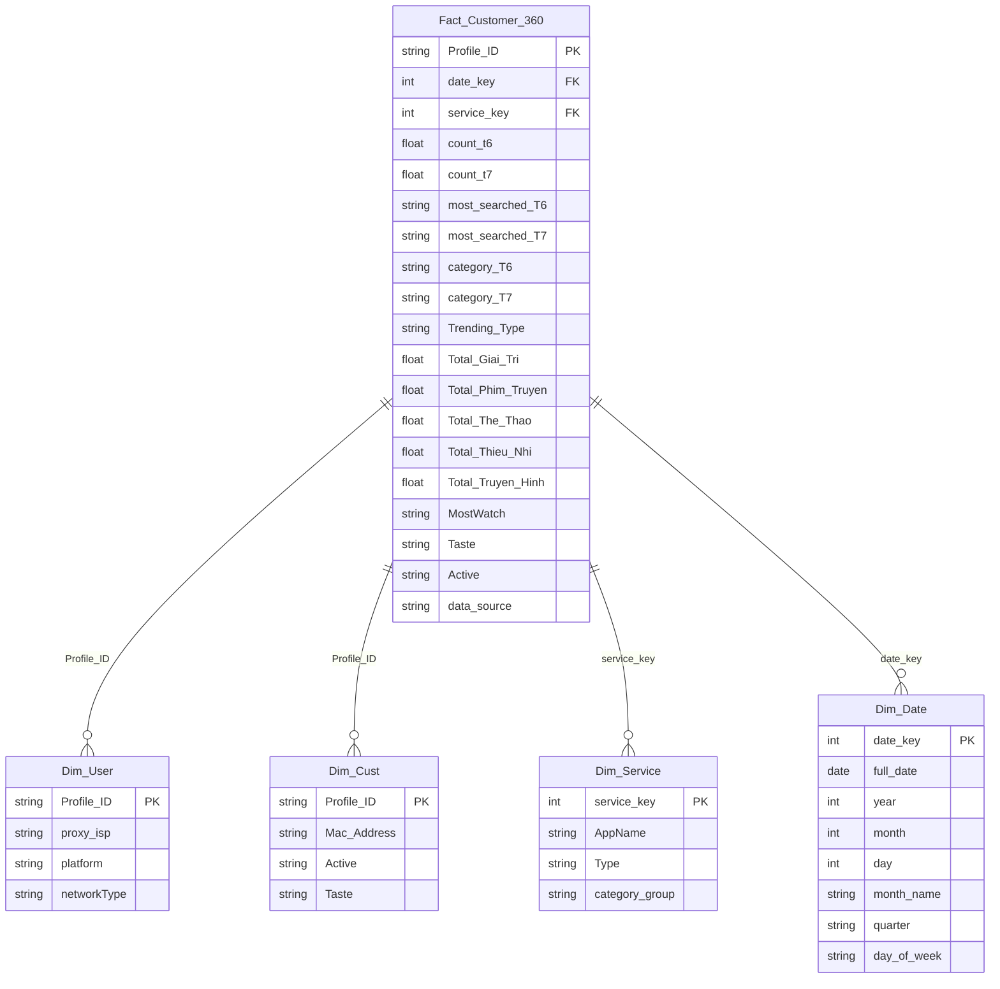
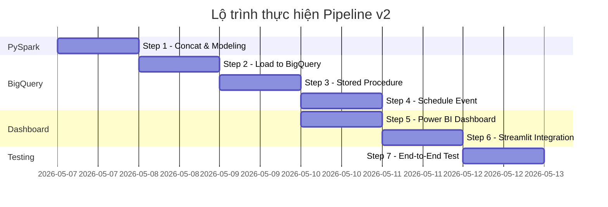

# 🔄 Data Pipeline Plan v2 — Từ Parquet → BigQuery → Dashboard

> **Bối cảnh:** 2 file `final_output_logsearch.parquet` và `final_output_logcontent.parquet` đã được ETL xong. Đây là **đầu vào duy nhất** của pipeline mới. Không cần đọc lại raw log nữa.

> [!IMPORTANT]
> Trên thực tế, sẽ có 1 bảng `Dim_Customer` (bảng chiều khách hàng) để nối theo `CustomerID` / `Contract`. Tuy nhiên vì đây là thông tin nhạy cảm nên thầy không share. Pipeline sẽ concat 2 bảng trực tiếp thay vì join qua bảng Dim.

---

## 📐 Kiến Trúc Tổng Thể (Architecture Overview)



---

## 📋 CHI TIẾT TỪNG BƯỚC

---

### 🔹 Step 1: Concat & Data Modeling (PySpark)
**File:** `etl_step1_concat_and_model.py`

#### 1.1 Đọc đầu vào
```python
df_search = spark.read.parquet("final_output_logsearch.parquet")
df_content = spark.read.parquet("final_output_logcontent.parquet")
```

#### 1.2 Chuẩn hóa khóa chính
- `df_search`: rename `user_id` → `Profile_ID`
- `df_content`: rename `Contract` → `Profile_ID`
- Thêm cột `source_flag` để đánh dấu nguồn gốc dữ liệu

#### 1.3 Concat theo yêu cầu thầy
> **Lý do concat thay vì join qua bảng Dim:** Trong thực tế, 2 bảng này sẽ được nối qua bảng `Dim_Customer` (chứa mapping `user_id ↔ Contract`). Vì bảng Dim nhạy cảm không được share, ta thực hiện **Full Outer Join theo `Profile_ID`** trực tiếp.

```python
df_concat = df_search.join(df_content, on="Profile_ID", how="outer")
```

#### 1.4 Data Modeling — Star Schema (Normalization)

> [!NOTE]
> **Yêu cầu thầy:** Phải có Data Modeling & Normalization. Không gộp bảng thô mà phải bóc tách thành Fact + Dimension. Thiết kế sao cho "fill vào CV" được — thể hiện tư duy Data Modeling chuẩn.

> [!IMPORTANT]
> **Theo hình vẽ của thầy**, hệ thống cần có: `Dim_service`, `Dim_cust`, `Dim_user` + bảng Fact trung tâm. Tôi bổ sung thêm `Dim_Date` (chiều thời gian) vì đây là bảng **bắt buộc** trong mọi Star Schema chuẩn công nghiệp.

##### 📊 Sơ đồ Star Schema (ERD)



##### 📝 Chi tiết từng bảng

| Bảng | Loại | Nguồn gốc | Mô tả | Cột chính |
|------|------|-----------|--------|-----------|
| `Fact_Customer_360` | **Fact** | Join `df_search` + `df_content` | Bảng sự kiện trung tâm, chứa các **metric đo lường** hành vi | `Profile_ID`, `count_t6/t7`, `Total_*_Duration`, `MostWatch`, `Trending_Type`, `data_source` |
| `Dim_User` | **Dimension** | Tách từ `df_search` | Thông tin **thiết bị/mạng** — Trả lời câu hỏi "User dùng gì?" | `Profile_ID`, `proxy_isp` (Viettel/VNPT/FPT), `platform` (Android/iOS), `networkType` (3G/Wifi) |
| `Dim_Cust` | **Dimension** | Tách từ `df_content` | Thông tin **khách hàng/hợp đồng** — Trả lời "Khách hàng là ai?" | `Profile_ID`, `Mac_Address`, `Active` (High/Low), `Taste` |
| `Dim_Service` | **Dimension** | Mapping từ `AppName` | Thông tin **dịch vụ/ứng dụng nội dung** — Trả lời "Xem trên dịch vụ nào?" | `service_key`, `AppName` (CHANNEL/VOD/FIMS/...), `Type` (Truyền hình/Phim/Thể thao/...), `category_group` |
| `Dim_Date` | **Dimension** | Generate từ range ngày | **Chiều thời gian** — Cho phép phân tích theo tháng/quý/ngày trong tuần | `date_key`, `full_date`, `year`, `month`, `quarter`, `day_of_week` |

##### 🔍 Giải thích lý do thiết kế (dành cho CV / phỏng vấn)

1. **Dim_User** (từ hình vẽ thầy): Tách riêng thuộc tính thiết bị/mạng ra khỏi Fact → tránh lặp dữ liệu khi 1 user có nhiều hành vi. Marketing có thể phân tích *"Bao nhiêu % user Viettel xem Phim Truyện?"* bằng 1 câu JOIN đơn giản.

2. **Dim_Cust** (từ hình vẽ thầy): Tách riêng thông tin hợp đồng/thiết bị phần cứng. Trong thực tế, đây sẽ chứa thông tin nhạy cảm (tên, SĐT, địa chỉ) từ hệ thống CRM — nhưng vì lý do bảo mật nên chỉ có `Mac_Address`.

3. **Dim_Service** (từ hình vẽ thầy): Đây là bảng thầy vẽ trên bảng. Chuẩn hóa danh mục dịch vụ/ứng dụng (`AppName` → `Type`). Cho phép phân tích *"Dịch vụ nào có thời lượng xem cao nhất?"* mà không cần lặp tên dịch vụ ở mỗi dòng Fact.

4. **Dim_Date** (bổ sung thêm): Mọi Star Schema chuẩn đều phải có bảng chiều thời gian. Cho phép phân tích xu hướng theo tháng, quý, ngày trong tuần — rất ấn tượng khi viết CV.

##### Cách tạo từng bảng Dimension:
```python
# Dim_User: Từ df_search, tách thuộc tính thiết bị/mạng
dim_user = df_search.select("Profile_ID", "proxy_isp", "platform", "networkType") \
                    .dropDuplicates(["Profile_ID"])

# Dim_Cust: Từ df_content, tách thông tin Contract/Hardware
dim_cust = df_content.select("Profile_ID", "Mac_Address", "Active", "Taste") \
                     .dropDuplicates(["Profile_ID"])

# Dim_Service: Mapping bảng dịch vụ (AppName → Type → category_group)
# Tạo từ logic phân loại đã có trong etl_script_log_content_new.py
service_mapping = [
    (1, "CHANNEL", "Truyen Hinh", "Live TV"),
    (2, "RELAX",   "Giai Tri",   "Entertainment"),
    (3, "CHILD",   "Thieu Nhi",  "Kids"),
    (4, "FIMS",    "Phim Truyen", "Movies"),
    (5, "VOD",     "Phim Truyen", "Movies"),
    (6, "KPLUS",   "The Thao",   "Sports"),
    (7, "SPORT",   "The Thao",   "Sports"),
]
dim_service = spark.createDataFrame(service_mapping, 
    ["service_key", "AppName", "Type", "category_group"])

# Dim_Date: Generate bảng lịch từ range ngày dữ liệu
# (Xem chi tiết trong code implementation)
```

#### 1.5 Output (5 bảng)
```
→ Fact_Customer_360.parquet    (Bảng Fact trung tâm)
→ Dim_User.parquet             (Chiều: Thiết bị/Mạng)
→ Dim_Cust.parquet             (Chiều: Khách hàng/Hợp đồng)
→ Dim_Service.parquet          (Chiều: Dịch vụ nội dung)
→ Dim_Date.parquet             (Chiều: Thời gian)
```

---

### 🔹 Step 2: Load to BigQuery (Python + pandas-gbq)
**File:** `etl_step2_load_to_bigquery.py`

| Source File | Target Table (BigQuery) | Mode |
|---|---|---|
| `Fact_Customer_360.parquet` | `cms_data_warehouse.fact_customer_360` | `APPEND` |
| `Dim_User.parquet` | `cms_data_warehouse.dim_user` | `APPEND` |
| `Dim_Cust.parquet` | `cms_data_warehouse.dim_cust` | `APPEND` |
| `Dim_Service.parquet` | `cms_data_warehouse.dim_service` | `REPLACE` |
| `Dim_Date.parquet` | `cms_data_warehouse.dim_date` | `REPLACE` |

> [!TIP]
> - **Fact + Dim_User + Dim_Cust**: Dùng `APPEND` vì dữ liệu chạy liên tục, mỗi batch nối thêm.
> - **Dim_Service + Dim_Date**: Dùng `REPLACE` vì đây là bảng tham chiếu tĩnh (ít thay đổi).

---

### 🔹 Step 3: Stored Procedure — Thống kê cho Marketing
**File:** `elt_stored_procedure.sql`

> [!IMPORTANT]
> **Yêu cầu thầy:** Marketer không cần biết từng user → cần **thông tin tổng thể** (bao nhiêu người thích xem phim, tỷ lệ thể loại...). Phải dùng Stored Procedure chứa `COUNT`, `SUM`, `GROUP BY`.

#### Store Procedure: `sp_run_pipeline()` (OLAP Layer)

Đây là tầng xử lý logic nghiệp vụ sâu (Level 3), tính toán các chỉ số quan trọng cho Marketing và Content.

```sql
CREATE OR REPLACE PROCEDURE `cms_data_warehouse.sp_olap_content`()
BEGIN
  DECLARE max_date INT64;
  SET max_date = (SELECT MAX(date_key) FROM `cms_data_warehouse.fact_customer_360` WHERE data_source = 'log_content');

  -- 1. Category giữ chân user tốt nhất
  CREATE OR REPLACE TABLE `cms_data_warehouse.olap_category_loyalty` AS
  SELECT
    MostWatch AS Category,
    COUNT(DISTINCT Profile_ID) AS TongUser,
    COUNT(DISTINCT CASE WHEN Active = 'High' THEN Profile_ID END) AS UserTrungThanh,
    ROUND(COUNT(DISTINCT CASE WHEN Active = 'High' THEN Profile_ID END) * 100.0 / NULLIF(COUNT(DISTINCT Profile_ID), 0), 2) AS TiLe_TrungThanh
  FROM `cms_data_warehouse.fact_customer_360`
  WHERE data_source = 'log_content' AND MostWatch IS NOT NULL AND date_key <= max_date
  GROUP BY MostWatch ORDER BY TiLe_TrungThanh DESC;

  -- 2. Trong từng Category, Taste nào dominant
  CREATE OR REPLACE TABLE `cms_data_warehouse.olap_category_taste` AS
  SELECT
    MostWatch AS Category,
    Taste,
    COUNT(DISTINCT Profile_ID) AS TongUser,
    ROUND(COUNT(DISTINCT Profile_ID) * 100.0 / SUM(COUNT(DISTINCT Profile_ID)) OVER (PARTITION BY MostWatch), 2) AS PhanTram_TrongCategory
  FROM `cms_data_warehouse.fact_customer_360`
  WHERE data_source = 'log_content' AND MostWatch IS NOT NULL AND Taste IS NOT NULL AND date_key <= max_date
  GROUP BY MostWatch, Taste;

  -- 3. Power user (High Active) xem gì
  CREATE OR REPLACE TABLE `cms_data_warehouse.olap_power_user_profile` AS
  SELECT
    MostWatch,
    COUNT(DISTINCT Profile_ID) AS TongUser,
    ROUND(COUNT(DISTINCT Profile_ID) * 100.0 / SUM(COUNT(DISTINCT Profile_ID)) OVER (), 2) AS PhanTram_TongUser
  FROM `cms_data_warehouse.fact_customer_360`
  WHERE data_source = 'log_content' AND Active = 'High' AND date_key <= max_date
  GROUP BY MostWatch;
END;

CREATE OR REPLACE PROCEDURE `cms_data_warehouse.sp_olap_search`()
BEGIN
  DECLARE max_date INT64;
  SET max_date = (SELECT MAX(date_key) FROM `cms_data_warehouse.fact_customer_360` WHERE data_source = 'log_search');

  -- 4. Tăng trưởng search T6 vs T7
  CREATE OR REPLACE TABLE `cms_data_warehouse.olap_search_growth` AS
  SELECT
    category_T6 AS Category,
    CAST(SUM(count_t6) AS BIGINT) AS LuotTimKiem_T6,
    CAST(SUM(count_t7) AS BIGINT) AS LuotTimKiem_T7,
    ROUND((CAST(SUM(count_t7) AS BIGINT) - CAST(SUM(count_t6) AS BIGINT)) * 100.0 / NULLIF(CAST(SUM(count_t6) AS BIGINT), 0), 2) AS PhanTram_TangTruong
  FROM `cms_data_warehouse.fact_customer_360`
  WHERE data_source = 'log_search' AND category_T6 IS NOT NULL AND category_T7 IS NOT NULL AND date_key <= max_date
  GROUP BY category_T6;

  -- 5. User dịch chuyển sở thích
  CREATE OR REPLACE TABLE `cms_data_warehouse.olap_interest_migration` AS
  SELECT
    category_T6 AS RoiKhoi,
    category_T7 AS ChuyenSang,
    COUNT(DISTINCT Profile_ID) AS TongUser
  FROM `cms_data_warehouse.fact_customer_360`
  WHERE data_source = 'log_search' AND Trending_Type = 'Changed' AND date_key <= max_date
  GROUP BY category_T6, category_T7;
END;
```

---

### 🔹 Step 4: Orchestration & Schedule — Kiến trúc phân tách trách nhiệm
**File:** `main_pipeline.py` (Python) + BigQuery Scheduled Query (Cloud)

> [!NOTE]
> **Yêu cầu thầy:** Dữ liệu chạy liên tục → cần schedule để Store Procedure tự cập nhật theo data mới.

> [!IMPORTANT]
> **Quyết định kiến trúc:** Phân tách trách nhiệm rõ ràng giữa **Python** (vận chuyển data) và **BigQuery** (tính toán báo cáo) để đảm bảo tính ổn định và độc lập cho Production.

#### Phần A: Python Orchestrator (`main_pipeline.py`) — Điều phối Step 1 → 2 → 3

```
┌───────────────────────────────────────────────────────────────┐
│  main_pipeline.py (02:00 AM — Task Scheduler / run_pipeline.bat) │
│  Hỗ trợ argparse: --start YYYYMMDD --end YYYYMMDD            │
│  Mặc định: tự động lấy ngày hôm qua (T-1)                   │
│                                                               │
│  STEP 1a: etl_step1_log_search.py --start --end              │
│     Raw log_search (parquet/ngày) → final_output_logsearch    │
│          │                                                    │
│  STEP 1b: etl_step1_log_content.py --start --end             │
│     Raw log_content (json/ngày) → final_output_logcontent     │
│          │                                                    │
│          ▼ (Chỉ chạy khi Step 1 thành công)                  │
│  STEP 2: etl_step2_obt_concat_model.py (PySpark ETL)         │
│     2 final_output → Concat → Star Schema → 5 file Parquet   │
│          │                                                    │
│          ▼ (Chỉ chạy khi Step 2 thành công)                  │
│  STEP 3: etl_step3_load_to_bigquery.py (Load)                │
│     5 file Parquet → BigQuery (Fact: APPEND / Dim: REPLACE)   │
└───────────────────────────────────────────────────────────────┘
```

- **Lập lịch:** Dùng **Windows Task Scheduler** thông qua `setup_schedule.bat` (hoặc Crontab trên Linux) để gọi `run_pipeline.bat` mỗi ngày lúc **02:00 AM**.
- **Chiến thuật Incremental Load:** Mỗi ngày Pipeline chỉ bốc dữ liệu mới (T-1) nhờ `argparse`, tránh đọc lại toàn bộ lịch sử.
- **Cơ chế an toàn:** Nếu bất kỳ Step nào lỗi → Pipeline dừng ngay, không đẩy data rác lên Cloud.
- **Logging:** Toàn bộ quá trình được ghi vào `pipeline.log` để kiểm tra lỗi vào sáng hôm sau.

#### Phần B: BigQuery Scheduled Query — Tự động chạy Step 4 (ELT)

```sql
-- Cấu hình trên BigQuery Console → Scheduled Queries
-- Lịch: Mỗi ngày lúc 03:00 AM (1 tiếng sau khi data đã được load xong)
CALL `bigdata-mapping.cms_data_warehouse.Calculate_Marketing_Report`();
```

- **Tại sao tách riêng Step 4?**
  - Step 4 chạy hoàn toàn trên Cloud → **không phụ thuộc** vào máy tính local.
  - Nếu Step 1–3 bị lỗi một ngày, báo cáo vẫn giữ dữ liệu cũ (không bị trắng trơn).
  - BigQuery cung cấp **monitoring, retry tự động, và thông báo lỗi** qua email.

#### Tổng kết luồng vận hành hàng ngày:

| Thời gian | Hành động | Nơi thực thi |
|-----------|-----------|--------------|
| **02:00 AM** | `run_pipeline.bat` → Step 1 (Raw Log) → Step 2 (Star Schema) → Step 3 (Load BQ) | Local / Server |
| **03:00 AM** | BigQuery Scheduled Query → `CALL Calculate_Marketing_Report()` | BigQuery Cloud |
| **Sáng** | Marketer mở Dashboard Power BI → số liệu đã được cập nhật mới nhất | Power BI |

---


### 🔹 Step 5: Dashboard — Power BI
**File:** `dashboard_marketing.pbix`

#### Các trang dashboard đề xuất & Cấu hình Visual:

| Trang | Nguồn dữ liệu (OLAP Table) | Ý nghĩa nghiệp vụ | Biểu đồ khuyên dùng (Power BI) |
|-------|----------------|-------------------|--------------------------------|
| **Trang 1: Loyalty & Retention** | `olap_category_loyalty` | Thể loại nào đang giữ chân user tốt nhất? Số lượng user có nguy cơ rời bỏ (Low Active) là bao nhiêu? | - **100% Stacked Bar Chart:** Trục Y là Category, Trục X là `UserTrungThanh` và `UserNguyCo` (xem tỷ lệ).<br>- **Line and Stacked Column Chart:** Cột là `TongUser`, Đường là `TiLe_TrungThanh` (xem quy mô vs chất lượng). |
| **Trang 2: Content Taste Breakdown** | `olap_category_taste` | Đi sâu vào từng Category, ví dụ trong Phim Truyện thì người dùng chuộng phim Hàn, Trung hay Hành động? | - **Treemap / Matrix:** Thể hiện phân cấp (Hierarchy) từ Category xuống Taste.<br>- **Donut Chart:** Tỷ trọng `PhanTram_TrongCategory`. |
| **Trang 3: Power User Insights** | `olap_power_user_profile` | Nhóm khách hàng VIP (Active = High) mang lại nhiều giá trị nhất đang xem nội dung gì? | - **Clustered Bar Chart:** So sánh `TongUser` theo `MostWatch`.<br>- **Card:** Hiển thị tổng số Power User. |
| **Trang 4: Search Growth** | `olap_search_growth` | Mức độ quan tâm của người dùng đang tăng lên hay giảm đi ở từng thể loại qua 2 tháng liên tiếp? | - **Waterfall Chart:** Xem mức độ tăng/giảm (`TangTruong`) của từng thể loại.<br>- **Clustered Column Chart:** So sánh trực quan `ThangTruoc` và `ThangNay`. |
| **Trang 5: Interest Migration** | `olap_interest_migration` | Người dùng chán một thể loại thì họ sẽ chuyển sang xem thể loại nào tiếp theo? | - **Sankey Diagram** (Tải thêm từ Get more visuals) hoặc **Ribbon Chart**: Vẽ dòng chảy từ `RoiKhoi` sang `ChuyenSang`.<br>- **Matrix:** Chi tiết số lượng user dịch chuyển. |

#### Kết nối dữ liệu:
- **Option A (BigQuery):** Power BI → Get Data → Google BigQuery → Direct Query
- **Option B (Local):** Export report tables ra `.csv` / `.parquet` → Power BI Import

---

### 🔹 Step 6: Tích hợp Dashboard vào Streamlit
**File:** `app_dashboard.py`

#### Cách embed Power BI vào Streamlit:

```python
import streamlit as st

st.set_page_config(page_title="Marketing Dashboard", layout="wide")
st.title("📊 Marketing Dashboard - Customer 360")

# Cách 1: Embed Power BI Published Report (nếu đã publish lên Power BI Service)
powerbi_url = "https://app.powerbi.com/view?r=<EMBED_TOKEN>"
st.components.v1.iframe(powerbi_url, height=600, width=1200)

# Cách 2: Nếu chưa publish Power BI, dùng Streamlit native charts
# Đọc data từ BigQuery hoặc local parquet và vẽ biểu đồ trực tiếp
```

> [!TIP]
> **Phương án thay thế nếu Power BI không publish được lên web:**
> Dùng Streamlit native với `plotly` / `altair` để tạo dashboard tương tự trực tiếp từ data BigQuery. Khi đó file `.pbix` vẫn nộp riêng cho thầy, còn Streamlit sẽ là bản web demo.

---

## 🗂️ Cấu trúc file sau khi hoàn thành

```
Class7/
├── final_output_logsearch.parquet     # ĐẦU VÀO (đã có)
├── final_output_logcontent.parquet    # ĐẦU VÀO (đã có)
│
├── etl_step1_concat_and_model.py     # Step 1: PySpark concat + modeling
├── etl_step2_load_to_bigquery.py     # Step 2: Load parquet → BigQuery
├── elt_stored_procedure.sql          # Step 3: Stored Procedure SQL
├── schedule_event_setup.sql          # Step 4: Schedule Event SQL
├── main_pipeline.py                  # Orchestrator (chạy Step 1→2→3)
│
├── dashboard_marketing.pbix          # Step 5: Power BI Dashboard
├── app_dashboard.py                  # Step 6: Streamlit web app
│
├── Fact_Customer_360.parquet/        # Output Step 1 (Fact)
├── Dim_User.parquet/                 # Output Step 1 (Dimension)
├── Dim_Cust.parquet/                 # Output Step 1 (Dimension)
├── Dim_Service.parquet/              # Output Step 1 (Dimension)
├── Dim_Date.parquet/                 # Output Step 1 (Dimension)
│
├── bigdata-mapping-*.json            # GCP credentials (đã có)
└── mapping.csv                       # (đã có)
```

---

## ✅ Checklist thực hiện

| # | Task | File | Trạng thái |
|---|------|------|-----------|
| 1 | Viết script PySpark concat + Star Schema 5 bảng (1 Fact + 4 Dim) | `etl_step1_concat_and_model.py` | ⬜ TODO |
| 2 | Cập nhật script load lên BigQuery (5 bảng) | `etl_step2_load_to_bigquery.py` | ⬜ TODO |
| 3 | Viết Stored Procedure thống kê Marketing (JOIN Fact + Dim) | `elt_stored_procedure.sql` | ⬜ TODO |
| 4 | Viết Schedule Event SQL + cập nhật orchestrator | `schedule_event_setup.sql` + `main_pipeline.py` | ⬜ TODO |
| 5 | Tạo dashboard Power BI (.pbix) | `dashboard_marketing.pbix` | ⬜ TODO |
| 6 | Tạo Streamlit app embed dashboard | `app_dashboard.py` | ⬜ TODO |
| 7 | Test end-to-end pipeline | `main_pipeline.py` | ⬜ TODO |

---

## 🔑 Thứ tự thực hiện đề xuất


